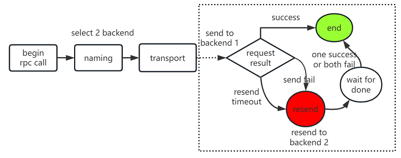

[English](../en/backup_request.md)

# 前言

有时为了保证可用性或降低长尾延时，需要同时访问两路服务，哪个先返回就取哪个。这种功能在实现上一般有两种做法：
1. 并发发送两个请求，然后取先返回的结果。
2. 设置一个合理的resend time，当一个请求在resend time内超时或失败了，再发送第二个请求，然后取先返回的结果。

其中做法1存在的问题是backend的流量会翻倍，做法2当选择的resend time合理时，正常情况下只会有一次请求，backend流量基本保存不变，鉴于此，我们选择做法2进行实现。

另外，考虑到当后端服务已经出现过载或异常时，重试请求会使得后端服务情况恶化。为避免这种情况，框架也提供了一种根据请求成功与否来自动终止重试的限流策略，详见[根据调用结果自动取消重试](#根据调用结果自动取消重试)。

# 调用流程



1. 调用时通过naming模块选择2个不同的后端节点，然后进入到transport层发送请求
2. transport层设置超时时长为resend time，然后发送请求到backend 1上，等待返回结果
3. 如果在resend time时间内请求成功了，则返回，结束调用
4. 如果在resend time时间内请求超时或失败了，则触发resend，发送请求到backend 2，然后等待结果。(如果首个请求超时了会将其超时时间修改为剩余的超时时间(请求timeout - resend time)，然后取backend 1及backend 2中较快的回包)

整个调用流程对用户是透明的，用户只需开启backup request，然后发起正常调用即可。

# 使用方式

## 开启backup request

backup request相关的api接口位于[ClientContext](../../trpc/client/client_context.h)，具体如下：

```cpp
void SetBackupRequestDelay(uint32_t delay);

void SetBackupRequestAddrs(const std::vector<NodeAddr>& addrs);
```

其中`SetBackupRequestDelay`用于指定resend time，调用该接口后则视为开启backup request。`SetBackupRequestAddrs`则用于用户自行设置调用后端节点。
在使用selector插件的情况下，调用后端节点由selector插件自动选取，这时仅需调用`SetBackupRequestDelay`即可。对于需自行设置调用后端节点的场景，要求先调用`SetBackupRequestDelay`后再调用`SetBackupRequestAddrs`进行设置。

使用示例如下：

```cpp
// 设置backup-request resend time为10ms
client_context->SetBackupRequestDelay(10);
// 发送请求，如果满足backup request触发条件的话会自动触发重试
auto status = service_proxy->SayHello(client_context, request, &reply);
```

## 根据调用结果自动取消重试

为避免当后端服务过载或异常时，backup request造成的额外流量冲击。我们实现了一个名为"retry_hedging_limit"的重试限流filter，来应对这种场景。

具体代码实现可见[RetryLimitClientFilter](../../trpc/filter/retry/retry_limit_client_filter.h)。在算法实现上使用了类似令牌桶限流机制，将桶内的令牌数初始化为max_tokens，请求成功时使令牌增加1，直到max_tokens；请求失败时则使令牌减少N(即token_ratio)，直到小于0。当桶内令牌数大于容量的一半时，重试/对冲策略才会正常生效；而当令牌数小于等于容量的一半时，取消重试。

此功能默认不开启。用户可通过如下配置文件方式：

```yaml
client:
  service:
    - name: trpc.test.helloworld.Greeter
      ...
      filter:
        - retry_hedging_limiter  # 开启限流策略，使用retry_hedging_limiter filter
      filter_config:  # service级别的filter独立配置，只针对该service下的对应filter生效；未配置的话将采用默认值
        retry_hedging_limiter:  # filter配置，retry_hedging_limiter为需要添加独立配置的filter名称
          max_tokens: 20  # 桶中的最大token个数，int型，默认为100
          token_ratio: 2  # 每一次失败的请求减少的token数与成功的请求增加的token数(成功时增加1)的比率，即失败时的惩罚系数，int型，默认为10
```

或代码指定方式：

```cpp
#include "trpc/common/config/retry_conf.h"
...
trpc::ServiceProxyOption option;
option.name = "trpc.test.helloworld.Greeter";
// add retry limit filter
option.service_filters.push_back(trpc::kRetryHedgingLimitFilter);

trpc::RetryHedgingLimitConfig config;
config.max_tokens = 20;
config.token_ratio = 2;
option.service_filter_configs[trpc::kRetryHedgingLimitFilter] = config;
proxy = trpc::GetTrpcClient()->GetProxy<...>(option.name, &option);
```

进行开启。开启后当发起客户端调用时，会先检查是否可以重试，如果不满足重试条件(当前token数 < max_tokens数/2)，会取消重试。

如果"retry_hedging_limit"重试限流filter的策略不满足需求的话，也可以自行实现限流filter，然后将其注册到框架后使用（依据情况作为service级别的filter或全局的filter）。filter注册和使用方式可参考[自定义拦截器](filter.md)。

## 查看backup request触发情况

框架内部提供了backup request相关的两个tvar变量(service_name为被调服务名)：
"trpc/client/service_name/backup_request" —— 表示触发了多少次backup request
"trpc/client/service_name/backup_request_success" —— 表示由backup request请求达到调用成功的次数

这两个变量支持使用管理命令查看：
```shell
curl http://admin_ip:admin_port/cmds/var/xxx #这边xxx为tvar变量名
```

也支持上报属性监控到对应的平台。

# 注意事项

1. 接口等幂：用户需要保证使用的RPC调用在不同的节点间是等幂的
2. 开启backup-request之前需要保证后端服务处理能力具有一定余量，以免触发backup-request时造成服务雪崩
3. 需要选择合理的resend time，以达到降低调用延时的同时，避免对后端服务的流量冲击。通常可以根据P90/P95/P99等指标来选择。
4. backup request不适用于udp、单向调用以及流式调用。
5. 如果服务后端只有一个可用节点或者设置的resend time大于请求的timeout，则backup request退化成正常的一发一收调用
